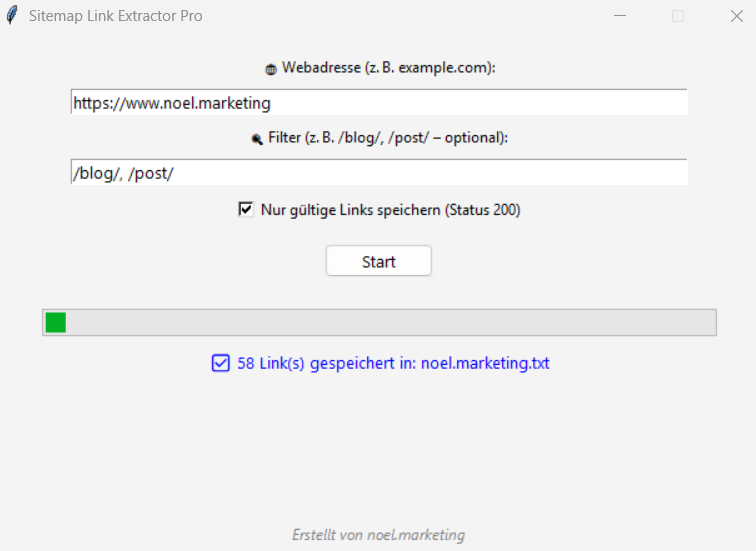

# 🧭 Sitemap Link Extractor Pro

Ein leistungsstarkes Python-Tool mit grafischer Oberfläche (GUI), das automatisch die `sitemap.xml` einer Website ausliest, Links filtert, auf Gültigkeit prüft und als `.csv` exportiert.

Ideal für SEOs, Content-Marketing, Technik-Teams und Website-Betreiber.

---

---

## ✨ Features

✅ Automatische Erkennung der `sitemap.xml` oder `sitemap_index.xml`  
✅ Filterfunktion: Nur bestimmte URL-Typen (z. B. `/blog/`, `/post/`)  
✅ Gültigkeitsprüfung per HTTP 200 Status  
✅ Keyword-Analyse der URL-Struktur  
✅ Export der Daten als `.csv`  
✅ Lokale GUI-Anwendung – keine Installation, kein Hosting notwendig  
✅ Kompilierbar als `.exe` für Windows-Nutzer

---

## 🧠 Warum eine Sitemap analysieren?

Die Sitemap enthält alle Seiten, die Google kennen soll. Die Analyse ermöglicht:

- Erkennen technischer Fehler (404, Weiterleitungen)
- Ableitung von Content-Strukturen & Themen
- Content-Audits & [Keyword-Strategien](https://marketingkosmos.de/blog/keyword-recherche-leitfaden)
- Unterstützung bei Website-Relaunches und Migrationen
- Export für Weiterverarbeitung in Excel oder Tools

---

## 🖥 Anwendung

1. Starte das Tool (`.py` oder `.exe`)
2. Gib die Domain ein (z. B. `https://example.com`)
3. Optional: Filter wie `/blog/`, `/post/`
4. Starte die Analyse
5. Speichere das Ergebnis als `.csv`

---

## 🔗 Weitere Infos

🌐 Projektseite: [noel.marketing](https://www.noel.marketing)  
📩 Feedback oder Fragen? → [Issue erstellen](../../issues)

---

## 🛡 Lizenz

MIT License – frei verwendbar, auch kommerziell.

---

## 🏷 Badges

  
  
  

